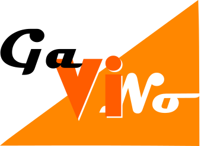
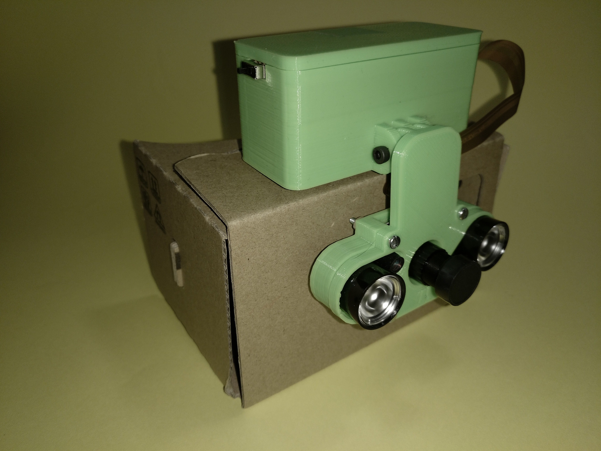

# gaVino

¿Te gustaría pasearte por el lado obscuro sin tropezar? Con este proyecto podrás hacerlo ya que si tienes una **Raspberry Pi Zero W** y una **Cámara IR** compatible podrás crearte estas **Gafas de Visión Nocturna**

Tienes información detallada del proyecto en mi [blog](https://robotstyles.blogspot.com.es/2018/04/gavino.html) 

